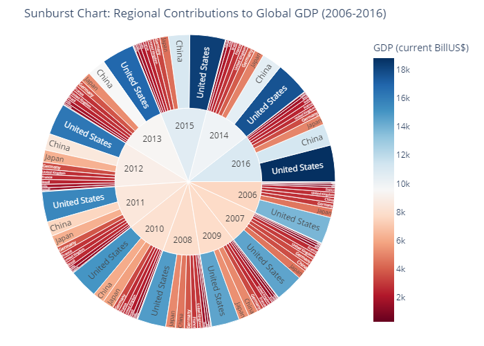

# World-after-Cold-War

 
 
## 1. Introduction: From Crisis to Crisis - How the World Economy Was Transformed

**"In late 2008, the world watched as Lehman Brothers, a major investment bank, collapsed, triggering a financial tsunami that left millions unemployed and entire economies in freefall. Fast forward to 2020, empty streets and shuttered businesses marked an eerie silence as Covid-19 spread across the globe, halting production, mobility, and the very essence of normal life."**

These two monumental events—**the 2008 financial crisis** and the **Covid-19 pandemic**—reshaped the global economy in profound ways. This report dives deep into how these crises affected not only economic growth but also the global population structure and military priorities. Understanding the impact of these events helps us appreciate the resilience and vulnerabilities within our systems, and it provides invaluable insights into how nations can better prepare for future disruptions.

### Objective of the Report
The goal of this analysis is to explore the intertwined effects of the 2008 financial crisis and the COVID-19 pandemic on:
- **Economic Indicators**: GDP growth rates, unemployment rates, government debt.
- **Population Dynamics**: Population growth, fertility rates, Population sex ratio.
- **Military Spending**: Shifts in military priorities before, during, and after each crisis.

We will compare these two crises to understand how different sectors and countries fared, what measures were taken, and what long-term shifts have occurred across global economies.

### Scope of Analysis
- **Timeframe**: The analysis spans from **1991** to **the present**, highlighting key shifts during **2008-2010** and **2020-2022**.
- **Countries of Focus**: We cover **ten leading economies**, including the United States, China, Germany, and emerging markets such as India and Brazil.
- **Indicators Considered**: GDP in trillion, GDP growth, unemployment, population growth, fertility rates, Population Sex Ratio, and Net in Goods and Services are core to understanding the ripple effects of these crises.

  ### ACT I

### Setting the Scene: The Calm Before the Storm
Before delving into the crises themselves, we first need to understand the economic landscape that preceded these major disruptions. The years leading up to **2008** were characterized by rapid economic growth, fueled by globalization, technological advancements, and expanding labor forces. From the United States to China, economies enjoyed robust growth, with rising GDPs and growing populations.

### GDP Analysis:

Imagine the world economy as a dynamic, ever-changing landscape. Between 1991 and 2006, major economies took vastly different paths. Here's what happened:

**The Unstoppable:**

US: Steady, upward growth, driven by tech innovation and financial services expansion.

China: Remarkable spike in GDP per capita in the early 1990s, marking the beginning of its rapid industrialization and global integration.

**The Steady but Slow:**

UK: Stable, yet slower growth, characteristic of a mature economy.

Germany: Modest gains with dips, influenced by post-reunification challenges.

France & Australia: Steady performers, with Australia benefiting from effective policies and commodity prosperity.

**The Stagnant and the Rising:**

Japan: Plateaued after the economic bubble burst, experiencing a "Lost Decade" with minimal growth.

Brazil & South Africa: Fluctuating but positive growth, showcasing resilience amidst global challenges.

**The Big Picture:**

The late 20th and early 21st centuries saw the West stabilizing, while the East, led by China, redefined the pace of economic growth. This set the stage for significant global economic shifts, highlighting the diverse impacts of technological advancements, economic reforms, and geopolitical events on national economies.

Now let's take a look at population analysis.

### Population Analysis and Fertility rate:

So as you can see between 1991 and 2006, the world witnessed significant demographic changes. Here are the key highlights:

**Fertility Rate Decline: A Global Phenomenon**

India: Dropped from 4 to 3+ live births/woman, driven by improved healthcare, education, and family planning.

China: Maintained low rates (<2 births/woman) due to strict family planning policies (e.g., one-child policy).

South Africa: Decreased from 3.5+ to 3 births/woman, reflecting improved socio-economic conditions.

Western Countries (US, Germany, UK): Stable, low rates (<2.1 births/woman), characteristic of mature economies.

**Population Growth Rate: Diverging Paths**

India: High, yet declining, growth rates due to gradually falling fertility rates.

China: Moderate, decreasing growth (1% to <0.5%) due to population control policies.

Germany & Japan: Stagnating/declining rates, highlighting aging population challenges.

**Sex Ratio Insights:**

China & India: Higher sex ratios, indicating cultural preferences for male children, with potential long-term social implications.

Western Countries (Germany, France): Balanced sex ratios, reflecting greater gender equality.

### Between 1991 and 2006, the world saw:

Global Shift to Smaller Families, driven by improved education, healthcare, and changing socio-economic conditions.
Diverging Population Growth Paths: Emerging markets (e.g., India) with positive growth, vs. developed economies (e.g., Germany, Japan) facing aging populations.
Sex Ratio Imbalances in China and India, highlighting cultural influences with significant long-term implications for gender equity and societal structures.

### Unemployment vs Net in Goods and Services:

**Economic Snapshots: Unemployment & Trade (1991-2006)**

**Unemployment: A Mixed Bag**

Let's have a look at unemployment and net trade indicators' key insights related to some major important historical and economic events:

| **Country** | **Unemployment Trend** | **Key Insight** |
| --- | --- | --- |
| **US** | **Down from 7% to 4%** | Economic boom & tech advances |
| **Germany** | **Volatility, peaking near 10%** | Reunification challenges |
| **India & China** | **Relatively low (<4%)** | Rapid industrialization & labor demand |
| **South Africa** | **High, around 20%** | Post-apartheid socio-economic struggles |

**Trade Tales: Surpluses & Deficits**

| **Country** | **Net Trade Trend** | **Key Driver** |
| --- | --- | --- |
| **US** | **Increasingly negative** | Growing dependence on imports |
| **Germany** | **Improving surplus** | Export-oriented economy & strong industry |
| **China** | **Rapidly improving** | Global manufacturing hub & WTO entry (2001) |
| **Japan** | **Declining surplus** | Post-bubble economy struggles |
| **France & Australia** | **Relatively balanced** | Stable exports & limited trade imbalances |

Between 1991 and 2006, the world economy was a complex puzzle. Nations faced unique challenges and seized opportunities, leading to:

1. **Divergent Unemployment Paths**: US success, German struggles, and South African socio-economic challenges.
2. **Trade Balance Dichotomy**: US deficits vs. German and Chinese surpluses, highlighting each country's global economic position.
3. **Globalization's Varied Impact**: Nations responded differently to globalization, policy choices, and economic events, shaping their economic destinies.

  ### ACT II

### Shockwaves: The 2008 Global Slowdown Hits

Welcome to 2008. Our heatmap of Real GDP Growth Rates paints a stark picture: dark red dominates the landscape, signaling contraction in many countries.

The average GDP growth rate bar plot drives the point home – the entire world economy felt the impact. GDP growth rates plummeted, with many countries facing negative growth in 2009. The global economy was in turmoil, struggling to adjust to the crisis.

**Key Insight:**
The 2008 financial crisis was a global phenomenon, with no country left unscathed.

**Valuable Lesson:** 
Interconnected economies mean that local shocks can have far-reaching consequences.

### Lives Turned Upside Down: The Unemployment Surge

Behind the economic numbers, people's lives were turned upside down. Our boxplot of Unemployment Rates (2006-2016) reveals the human cost of the crisis – job losses soared as businesses struggled to survive. Between 2008 and 2010, unemployment rates peaked across multiple countries, with some nations facing even more extreme hardships (visible as outliers). The road to recovery was long and arduous, with some economies still grappling with high unemployment in 2016.

**Key Insight:**
The crisis had a devastating impact on employment, with some countries taking years to recover.

**Actionable Advice:**
Governments and businesses must prioritize job creation and support during economic downturns.

### Ripples Across Borders: Trade and Interdependence

The crisis sent shockwaves through global trade, disrupting the flow of international goods and services. Our stacked area chart for Net Trade in Goods and Services illustrates the deep impact on countries like the United States, which faced significant trade deficits. The slowdown in international trade highlights the interconnectedness of economies – the crisis was not just a domestic issue, but a global problem requiring coordinated solutions.

**Key Insight:**
Global trade is deeply interconnected, making it vulnerable to economic shocks.

**Strategic Recommendation:** 
Diversify trade relationships and foster international cooperation to mitigate future risks.

### A Gradual Rebuild: Resilience and Contributions

Amidst the turmoil, resilience shone through. Our sunburst chart for Regional Contributions to Global GDP (2006-2016) showcases how major economies like China and the United States adapted and contributed to the global recovery. While Western economies stumbled, China's growth played a crucial role in leading the world out of the downturn. This visualization highlights the shifting economic power dynamics and the importance of key players in the recovery phase.

**Key Insight:** 
Economic resilience and adaptability are crucial for leading global recovery efforts.

**Forward-Looking Strategy:** 
Foster economic cooperation and encourage the growth of emerging economies to drive future global prosperity.

### ACT III

**The Second Tsunami Big Wave (2016-2024)**

As we conclude our journey through the complexities of the global economy, ACT III presents a tale of two challenges: the trade war and the pandemic. These events have reshaped the economic landscape, testing the resilience of nations. Let's dive into the four pivotal plots that illustrate this transformative period.

### 1. Trade War: China's Perfect Storm (2016-2019)

- **The Plot Thickens:** Our line chart exposes the trade war's devastating impact on China's net exports, plummeting under U.S. pressure.
- **Global Ripple Effects:** While China struggled, Germany and India maintained stable trade, indicating a targeted U.S. approach.
- **Valuable Insight:** Diversification is key; China's reliance on U.S. trade left it vulnerable to policy shifts.

### 2. Pandemic Unemployment: A Global Reckoning (2020-2022)

- **Unemployment Tsunami:** Our bar chart vividly depicts the pandemic's brutal impact on job markets worldwide, with South Africa's rates soaring above 25%.
- **Global Shutdown:** Peaks in 2020 and 2021 underscore the pandemic's crippling effect on businesses and economies.
- **Key Takeaway:** Economic resilience is crucial; nations with robust support systems weathered the storm better.

### 3. The Population Growth Conundrum: A Pandemic Accelerant (2020-2024)

- **eclining Growth Rates:** Our plot reveals the pandemic's role in accelerating existing trends, pushing most countries below the 1% growth threshold.
- **Demographic Concerns:** Germany and Japan's already-low growth rates hit unprecedented lows, foreshadowing potential productivity challenges.
- **Valuable Insight:** Adaptation is essential; nations must address demographic shifts to maintain economic vitality.

### 4. Net Trade Recovery: China's Resurgence (2021-2024)

- **Post-Pandemic Rebound:** Our stacked area chart showcases China's remarkable recovery, capitalizing on global demand to regain trade momentum.
- **Diverging Fortunes:** The U.S. trade deficit persists, highlighting China's adeptness in navigating the new economic landscape.
- **Key Takeaway: Agility is a competitive advantage;** China's swift response enabled its resurgence.
