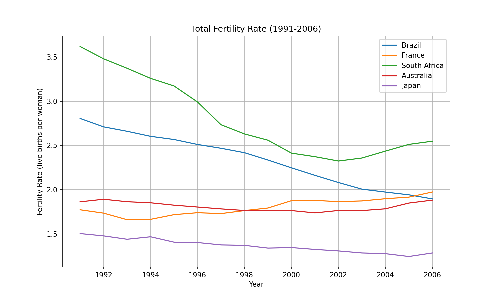
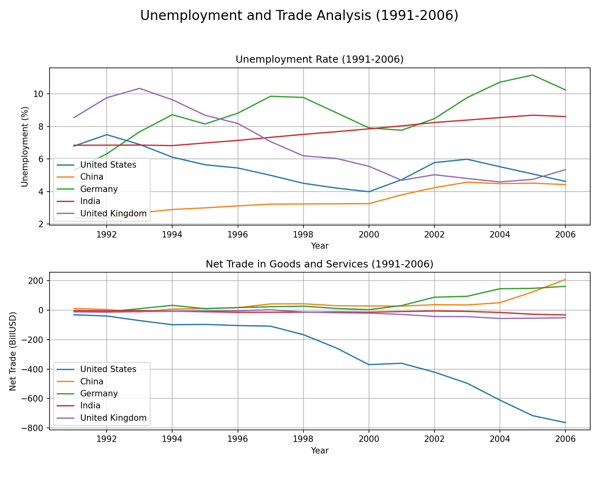
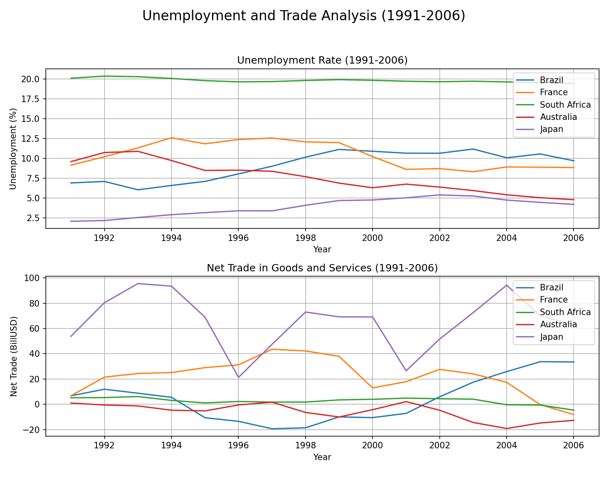

# World-after-Cold-War

 
 
## 1. Introduction: From Crisis to Crisis - How the World Economy Was Transformed

**"In late 2008, the world watched as Lehman Brothers, a major investment bank, collapsed, triggering a financial tsunami that left millions unemployed and entire economies in freefall. Fast forward to 2020, empty streets and shuttered businesses marked an eerie silence as Covid-19 spread across the globe, halting production, mobility, and the very essence of normal life."**

These two monumental events—**the 2008 financial crisis** and the **Covid-19 pandemic**—reshaped the global economy in profound ways. This report dives deep into how these crises affected not only economic growth but also the global population structure and military priorities. Understanding the impact of these events helps us appreciate the resilience and vulnerabilities within our systems, and it provides invaluable insights into how nations can better prepare for future disruptions.

### Objective of the Report
The goal of this analysis is to explore the intertwined effects of the 2008 financial crisis and the COVID-19 pandemic on:
- **Economic Indicators**: GDP growth rates, unemployment rates, government debt.
- **Population Dynamics**: Population growth, fertility rates, migration trends.
- **Military Spending**: Shifts in military priorities before, during, and after each crisis.

We will compare these two crises to understand how different sectors and countries fared, what measures were taken, and what long-term shifts have occurred across global economies.

### Scope of Analysis
- **Timeframe**: The analysis spans from **1991** to **the present**, highlighting key shifts during **2008-2010** and **2020-2022**.
- **Countries of Focus**: We cover **ten leading economies**, including the United States, China, Germany, and emerging markets such as India and Brazil.
- **Indicators Considered**: GDP in trillion, GDP growth, unemployment, population growth, fertility rates, Population Sex Ratio, and Net in Goods and Services are core to understanding the ripple effects of these crises.

### Setting the Scene: The Calm Before the Storm
Before delving into the crises themselves, we first need to understand the economic landscape that preceded these major disruptions. The years leading up to **2008** were characterized by rapid economic growth, fueled by globalization, technological advancements, and expanding labor forces. From the United States to China, economies enjoyed robust growth, with rising GDPs and growing populations.

### GDP Analysis:

Imagine the world economy as a dynamic, ever-changing landscape. Between 1991 and 2006, major economies took vastly different paths. Here's what happened:

The Unstoppable:

US: Steady, upward growth, driven by tech innovation and financial services expansion.
China: Remarkable spike in GDP per capita in the early 1990s, marking the beginning of its rapid industrialization and global integration.

The Steady but Slow:

UK: Stable, yet slower growth, characteristic of a mature economy.
Germany: Modest gains with dips, influenced by post-reunification challenges.
France & Australia: Steady performers, with Australia benefiting from effective policies and commodity prosperity.

The Stagnant and the Rising:
Japan: Plateaued after the economic bubble burst, experiencing a "Lost Decade" with minimal growth.
Brazil & South Africa: Fluctuating but positive growth, showcasing resilience amidst global challenges.
The Big Picture: The late 20th and early 21st centuries saw the West stabilizing, while the East, led by China, redefined the pace of economic growth. This set the stage for significant global economic shifts, highlighting the diverse impacts of technological advancements, economic reforms, and geopolitical events on national economies.

### Population Analysis and Fertility rate:

### Unemployment vs Net in Goods and Services:

